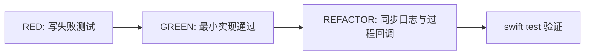

# TDD 测试说明

## 测试策略

本项目先写测试再实现，核心测试集中在 `Tests/ConvertCoreTests`，使用 Swift 6 自带 `Testing`。



## 已覆盖行为

- `VideoScannerTests`：递归发现视频，忽略非视频，并推导同目录同名 `mp3`。
- `TaskStateStoreTests`：保存并恢复成功状态；即使没有状态文件，只要 `mp3` 已存在也标记为成功。
- `ConversionCoordinatorTests`：并发数不超过配置；停止后不会继续启动所有待处理任务。
- `FileLoggerTests`：日志落盘并包含事件、状态、源文件等排查字段。

## 验证命令

```bash
swift test
```

当前通过标准：全部测试通过，且 `swift build -c release` 能生成 Release 可执行文件。
