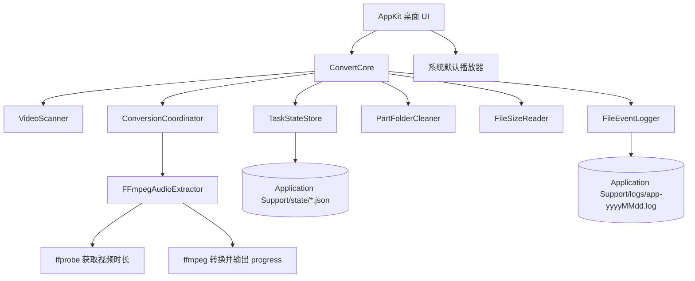
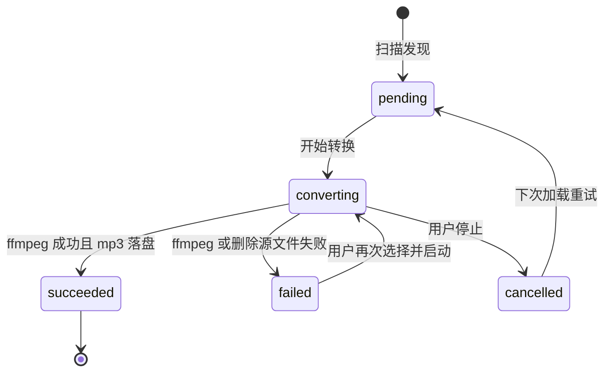
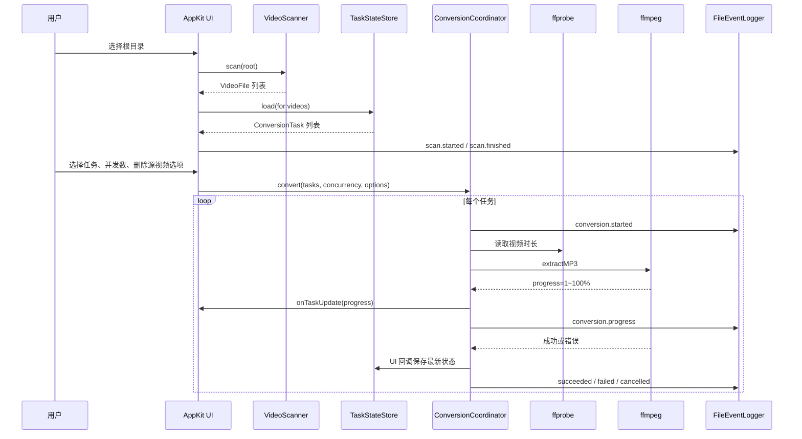
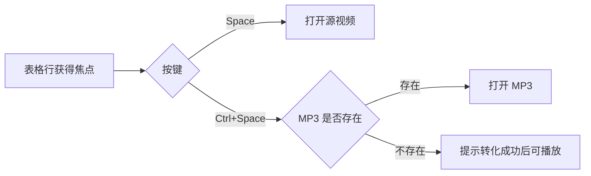

# Convert Video 2 MP3 设计与实现说明

## 目标

本应用是一个 macOS 桌面工具：用户选择根目录后，应用递归发现视频文件，支持单选、多选、全选，并将所选视频在原目录下提取为同名 `mp3`。应用会记录最近打开的根目录、转换状态、进度百分比和完整运行日志，重启后会跳过已成功生成的音频。

## 分层设计

## 核心模块

- `VideoScanner`：递归扫描目录，按扩展名识别视频，输出 `VideoFile(sourceURL, outputURL)`。
- `TaskStateStore`：把任务状态保存为 JSON。重新加载时，如果目标 `mp3` 已存在，会直接标记为成功。
- `ConversionCoordinator`：按用户选择的并发数调度转换任务，支持 4、6、8 等并发配置，也支持停止后取消未开始任务、成功后删除源视频、进度回调。
- `PartFolderCleaner`：递归扫描当前根目录，找出包含 `.mp4.part` 文件的文件夹；用户确认后递归删除这些文件夹。
- `FileSizeReader`：读取源视频和输出 MP3 的文件大小，并汇总当前任务列表的视频总大小和 MP3 总大小。
- `FFmpegAudioExtractor`：先通过 `ffprobe` 读取视频时长，再解析 `ffmpeg -progress pipe:1` 输出的 `out_time_ms` 计算 1~100% 进度。音频先写入隐藏临时文件 `.xxx.mp3.part`，成功后再移动为最终 `mp3`，避免半成品被当作成功。
- `FileEventLogger`：结构化日志，包含事件名、状态、源文件、输出文件、进度和错误信息。

## 状态流

## 数据流

## 快捷播放

## 关键恢复策略

- 已经存在目标 `mp3`：启动扫描和转换前都会跳过，避免重复转换。
- 转换中断：临时文件使用 `.part` 后缀，下次转换前会删除旧临时文件并重新生成，保证最终文件要么完整成功，要么不会被标记为成功。
- 用户停止：停止请求会阻止新任务启动，并让运行中的 `ffmpeg` 尽快终止。
- 成功后删除源视频：仅在用户勾选“成功后删除源视频”且本次转换成功后执行；已经存在的 `mp3` 被跳过时不会顺手删除源视频。
- 进度百分比：优先用 `ffprobe` 总时长计算；如果某个文件拿不到时长，则结束时至少更新到 100%。
- `.mp4.part` 文件夹清理：应用只自动识别候选文件夹，删除前必须用户确认；确认后递归删除整个候选文件夹。
