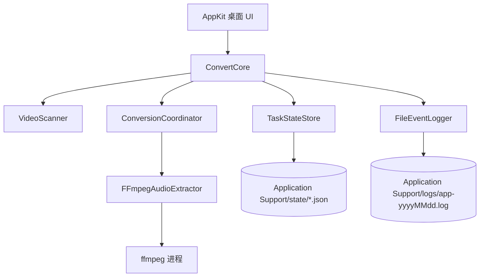
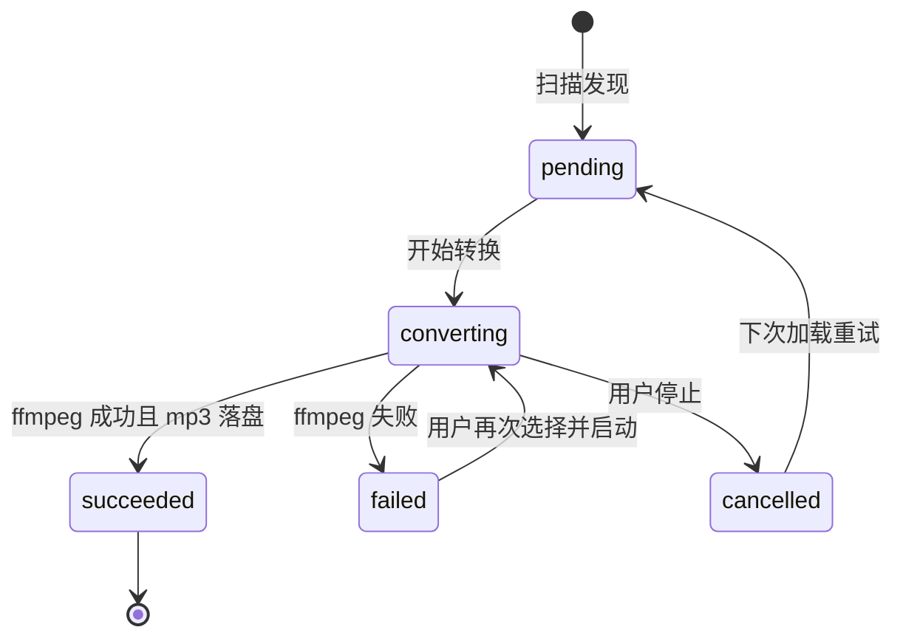
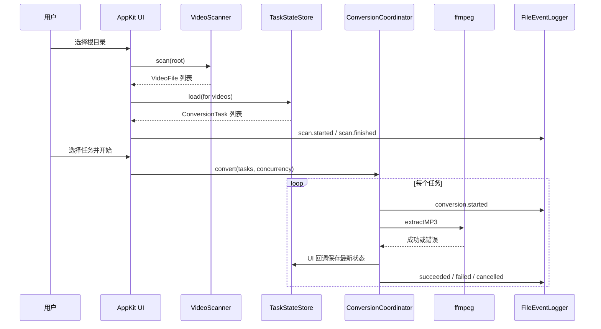

# Convert Video 2 MP3 设计与实现说明

## 目标

本应用是一个 macOS 桌面工具：用户选择根目录后，应用递归发现视频文件，支持单选、多选、全选，并将所选视频在原目录下提取为同名 `mp3`。应用会记录最近打开的根目录、转换状态和完整运行日志，重启后会跳过已成功生成的音频。

## 分层设计

## 核心模块

- `VideoScanner`：递归扫描目录，按扩展名识别视频，输出 `VideoFile(sourceURL, outputURL)`。
- `TaskStateStore`：把任务状态保存为 JSON。重新加载时，如果目标 `mp3` 已存在，会直接标记为成功。
- `ConversionCoordinator`：按用户选择的并发数调度转换任务，支持 4、6、8 等并发配置，也支持停止后取消未开始任务。
- `FFmpegAudioExtractor`：调用本机 `ffmpeg`，先写入隐藏临时文件 `.xxx.mp3.part`，成功后再移动为最终 `mp3`，避免半成品被当作成功。
- `FileEventLogger`：结构化日志，包含事件名、状态、源文件、输出文件和错误信息。

## 状态流

## 数据流

## 关键恢复策略

- 已经存在目标 `mp3`：启动扫描和转换前都会跳过，避免重复转换。
- 转换中断：临时文件使用 `.part` 后缀，下次转换前会删除旧临时文件并重新生成，保证最终文件要么完整成功，要么不会被标记为成功。
- 用户停止：停止请求会阻止新任务启动，并让运行中的 `ffmpeg` 尽快终止。
